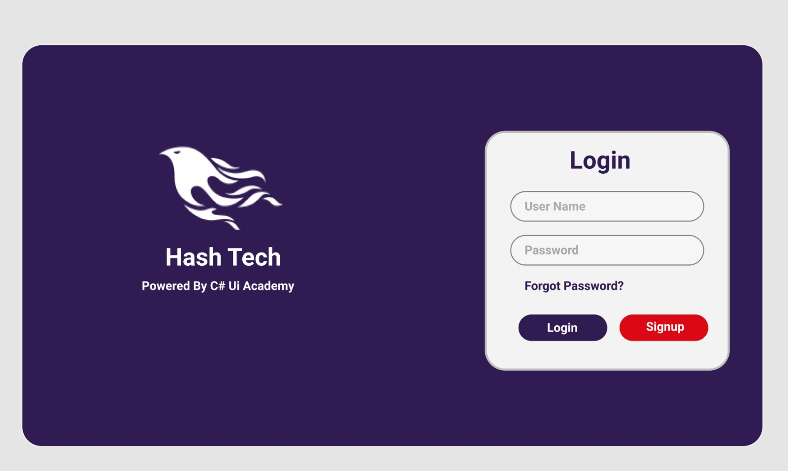

# Login Page Implementation

This project is a fully responsive login page that was translated from an image into code using HTML, CSS, and JavaScript. The page features a clean and modern design, with smooth interactions and validation to enhance user experience.

## Features

- **Responsive Design**: The login page adjusts to different screen sizes for optimal user experience across devices.
- **Interactive Elements**: Includes basic form validation and dynamic interactions using JavaScript.
- **Clean Code**: Follows best practices for HTML, CSS, and JavaScript.

## Technologies Used

- **HTML5**: For structuring the login form and layout.
- **CSS3**: For styling and creating a responsive design.
- **JavaScript**: To handle form validation and interactive elements.

## Installation

To run this project locally:

1. Clone the repository:

## Contributions

Feel free to fork this repository and submit a pull request if you'd like to contribute or improve the project.

## License

This project is licensed under the MIT License - see the [LICENSE](LICENSE) file for details.
